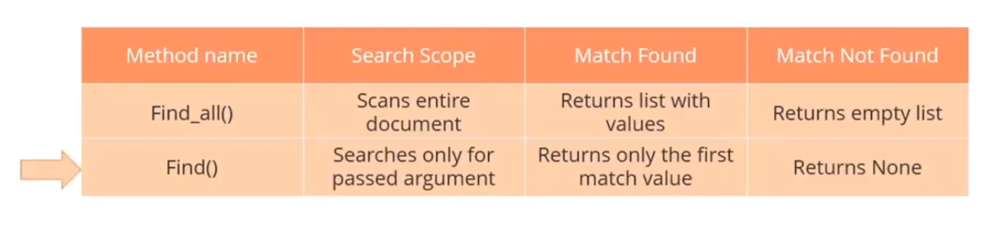
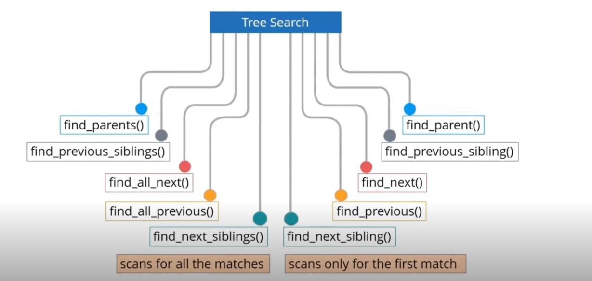

# Web Scraping Course - SimpliLearn

> **Introduction to code and Beautiful Soup** in `intro.ipynb`

```html
<!DOCTYPE html>
<html>
<body>
<div class="organizationlist">
  <ul id="HR">
    <li class="HRmanager">
      <div class="name">Jack</div>
      <div class="ID">101</div>
    </li>
    <li class="ITmanager">
      <div class="name">Daren</div>
      <div class="ID">65</div>
    </li>
  </ul>
</div>
</body>
</html>
```

> `<div>` ---> this tag's class has CSS applied

---

```
|-BeautifulSoup            # Parent
|--html                    # Direct Child |
|---div:organizationlist                 |  Descendants   
|----ul:IT                               V
|----ul:HR
|-----li: HRmanager
|------div: Class:name
|------div: Class:ID
|-----li: HRmanager
|------div: Class:name
|------div: Class:ID
|----ul:Finance
```

---

## Searching Tree Filters

With the help of search filters we can extract specific information from the parsed document. These filters act as search criteria to extract data based on the elements in the HTML structure.

### Types of Filters:

* **String**: Simplest filter. Searches tags matching the given string.
* **List**: Filter by matching any string in the list.
* **Regular Expressions**: Use regex for pattern matching.
* **Function**: Custom filter logic using user-defined functions.
* **Keyword Arguments**: Use tag attributes as arguments (e.g., `id`, `class_`).

### Searching Methods:

#### **find\_all()**

Searches and retrieves all matching tag descendants.

```python
soup.find_all(name, attrs, recursive, string, limit, **kwargs)
```

#### **find()**

Returns the first matching result. Use when only one element is needed.



#### **select()** (CSS selectors)

```python
soup.select("div.class")
soup.select("ul#HR > li")
```

#### **select\_one()**

Same as `select()` but returns only the first match.

#### **get\_text()**

Used to extract inner text from a tag.

```python
tag.get_text(strip=True)
```

#### **attrs**

To extract attribute value.

```python
tag['href']
```

---

## Tree Navigation:

* `.contents`: A tag's children as a list.
* `.children`: Iterator version of `.contents`.
* `.descendants`: All children, recursively.
* `.parent`: Immediate parent.
* `.parents`: Generator of all parent elements.
* `.next_sibling` / `.previous_sibling`: Navigate to adjacent nodes.
* `.next_element` / `.previous_element`: Next element in the tree, even if not a sibling.



---

## Modifying the Tree:

* `.append()`: Add child to tag
* `.insert()`: Insert element at given position
* `.clear()`: Remove all contents
* `.extract()`: Remove tag from tree and return it
* `.decompose()`: Same as extract but deletes it
* `.replace_with()`: Replace tag with another

---

## Handling Encodings

* `soup = BeautifulSoup(html_doc, 'html.parser')`
* `soup = BeautifulSoup(html_doc, 'lxml')` → faster & more powerful

---

## Dealing with JSON & APIs:

Some modern sites return JSON instead of HTML.

* Use `requests.get(url).json()`
* Navigate like a normal dictionary

---

## Handling Pagination

Loop through `next page` links or numbered pages programmatically.

```python
while next_url:
    response = requests.get(next_url)
    soup = BeautifulSoup(response.text, 'html.parser')
    next_url = soup.select_one("a.next")['href']
```

---

## Selenium WebDriver (Dynamic Scraping)

> For JS-rendered websites, forms, and automation — covered in `selenium_scraper.ipynb`

### Installation:

```bash
pip install selenium
```

### Basic Setup:

```python
from selenium import webdriver
from selenium.webdriver.chrome.service import Service
from selenium.webdriver.common.by import By
from webdriver_manager.chrome import ChromeDriverManager

options = webdriver.ChromeOptions()
driver = webdriver.Chrome(service=Service(ChromeDriverManager().install()), options=options)

# Open URL
driver.get("https://example.com")
```

### Interaction:

```python
element = driver.find_element(By.CLASS_NAME, "some-class")
element.click()
element.send_keys("text")
```

### Waits:

```python
from selenium.webdriver.support.ui import WebDriverWait
from selenium.webdriver.support import expected_conditions as EC

WebDriverWait(driver, 10).until(
    EC.presence_of_element_located((By.ID, "some_id"))
)
```

### Extracting HTML with Selenium:

```python
from bs4 import BeautifulSoup
soup = BeautifulSoup(driver.page_source, "html.parser")
```

---

## Handling Cookies & Headers

```python
headers = {
  'User-Agent': 'Mozilla/5.0...'
}
response = requests.get(url, headers=headers)
```

---

## Anti-Scraping & Bypass Techniques:

* Rotate User-Agent
* Add delay/random wait between requests
* Use Proxies or Tor
* Headless browsers

---

## Projects & Experiments:

✅ `intro.ipynb`: Basic Parsing & Tree Navigation
✅ `lab1.ipynb`: Tree Searching with Filters
✅ `selenium_scraper.ipynb`: JS Website Scraping & Automation
🔜 **Project - Case Summarizer & Classifier** using data from `indiankanoon.org`

---

> Next: Create a scraper for Indian Kanoon using requests, BeautifulSoup, and Selenium (for dynamic content and login pages).

Let me know when you're ready to move to the classifier part or need help bypassing captchas or IP restrictions. 💻
