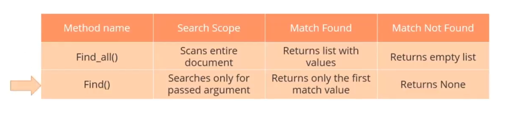
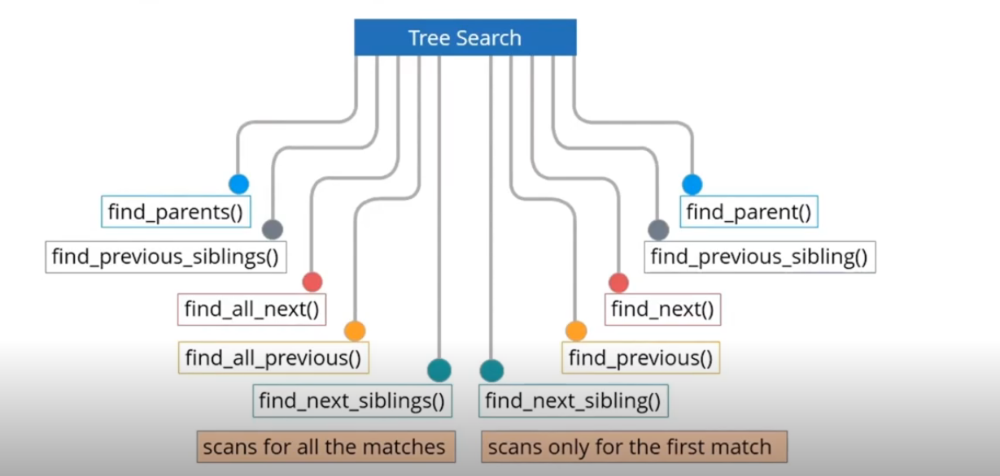

# Web Scraping Course - SimpliLearn

>Introduction to code and Beautoful Soup in in intro.ipynb

```
<! DOCTYPE html>
<html>
<body>
<div class="organizationlist">
<ul id="HR">
<li class="HRmanager">
<div class="name">Jack</div>
<div class="ID">101</div>
</li>
<li class="ITmanager">
<div class="name">Daren</div>
<div class="ID">65</div>
</li>
</ul>
</div>
</body>
</html>
```

> ```<div>``` ---> this tag's class has CSS

---
```
|-BeautifulSoup            #Parent
|--html                    #Direct Child |
|---div:organizationlist                 |  Decendants   
|----ul:IT                               V
|----ul:HR
|-----li: HRmanager
|------div: Class:name
|------div: Class:ID
|-----li: HRmanager
|------div: Class:name
|------div: Class:ID
|----ul:Finance

```
---

## Searching Tree Filters

With the help of search filter we can extrac specific information from the parsed Document.
The Filters can be treated as search criteria for the extracting the information based on the elements present in the document.
<br>The various kind sof filters used for searching an information from a tree:

- **String**: A string is the simplest filter. BeautifulSoup will perform a match against the search string.
- **List**: A list filters the string that matches against the search item in the list.
- **Regular Expressions**: A regular expression filters the match against the search criteria.
- **Function**: A list filters the string that matches against the search item in the list.
<br>
### Searching Methods:

- **find_all()**: Searches and retrieves all the tags descendants that matches your filters.
```python
#Synatax

find_all(name, attrs, recursive, string, limit, **kwargs)

#find_all: Method
#name: pass arguements for tags with names.
#attrs: Pass arguements for tags with attributes.
#recursive: Pass arguements as Boolean values for recursive operation.
#string: Search for string insteead of tags.
#limit: Limit the search result to numeric value passed in the arguement.
#**kwargs: Filter multiple attributes by passing multiple keywords in the arguement.
```
- **find()**: While find_all() find the entire doc looking for the results. To find one result, use find(). The find() method has a syntax similar to thta of the find_all() method; however, there are some key differences.

---

## Searching the tree with other methods:
Searching the parsed tree can also be perfromed by various other methods such as following:

---
>Searching the tree with filters is done in lab1.ipynb

## NEXT ARE SOME PROJECTS FOR my BTP 
## from indiankanoon.org site!